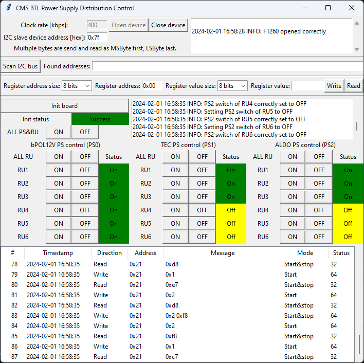

# I2C Python3.6+ GUI for [FT260](https://www.ftdichip.com/Products/ICs/FT260.html) chip

This GUI provides manual control over FT260 chip acting as USB to I2C master converter.
FT260 should be connected to the USB bus on one end and some slave device/devices on the I2C end.
There are many cheap modules based on FT260 on the market. This GUI should be compatible with any of them.
You should only check the low and high logic levels. FT260 ise 3.3V TTL logic.

The I2C slave device could be a sensor, nonvolatile memory, low speed ADC or DAC, and many others.
Each have their own 7 bit address. There may be no two devices with same same addresses on the bus.

## Functionality

I2C address scanner. It shows 7 bit addresses that acknowledge themselves on the bus.

Register read/write. Many devices have internal configuration registers. Register access is done by writing register 
address first, then either writing its new value, or initiating new read sequence to retrieve current value.
Register address size 8/16 bit and register word size 8/16/32 bit can be selected.     

Data read/write. It is a way to send data to and receive data from the device.
May be useful for devices without configuration registers.
You can select the length of data read/write operation and data word size.

I2C bus log. Every bus data transfer is given a sequential number, a timestamp, read/write feature,
slave device address, data content, start/stop flags and bus status.
Message byte order corresponds to the order of byte transfer on the bus.
Bus status flag is not decoded. You can reference it with FT260 documentation.

An standalone executable can be easily build with PyInstaller.

## Requirements

Python 32bit is required since FTDI provides only 32bit FT260 library binaries. Windows OS only.
The program can run on Linux, but without any FT260 operations since FTDI provides only windows library binaries.

The GUI is build with tkinter library.

## Run Gui

* `pip install tkinter`
* `pip install smbus2` (Linux only)
* `python ftI2cGui.py`

## GUI example

This is an example of GUI interface interacting with MPU6050 accelerometer/gyroscope sensor. MPU6050 is enabled
by writing to 8bit control register. Then actual accelerometer reading can be loaded by reading 16bit register.

  

## Build standalone application

* `pip install PyInstaller`
* `pyinstaller -wF ftI2cGui.py` to Build **dist\ftI2cGui.exe**
* `mkdir dist\lib && copy lib\LibFT260.dll dist\lib\`
* then you can run **ftI2cGui.exe** in dist directory
